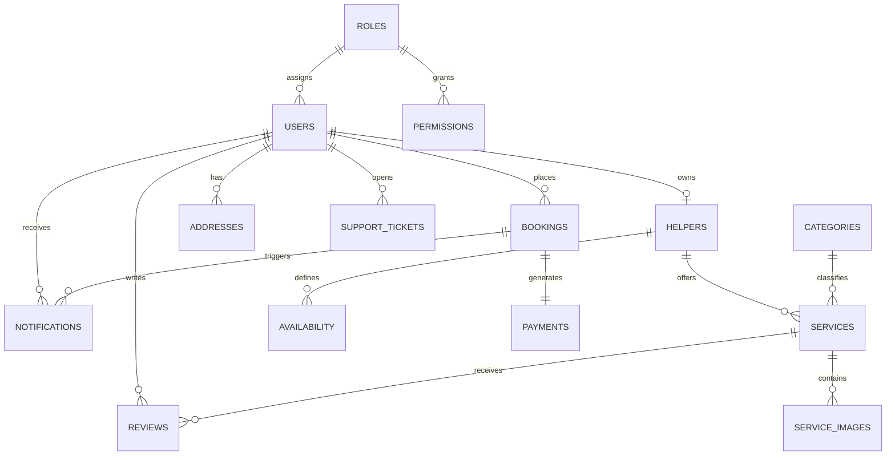

# Database Documentation

## Overview

The application uses PostgreSQL as the primary relational database. Prisma ORM is used for schema definition, migrations, and type-safe queries, enabling a clean domain-driven data model for the marketplace.

## Core Domain Model

The core entities are:

- users
- helpers
- categories
- services
- service_images
- bookings
- payments
- reviews
- addresses
- notifications
- support_tickets
- availability
- roles
- permissions
- audit_logs

## Entity Relationship Summary

```text
users 1---1 helpers
users 1---many bookings
helpers 1---many services
services 1---many service_images
services 1---many reviews
bookings 1---1 payments
bookings 1---many notifications
users 1---many support_tickets
helpers 1---many availability
users 1---many addresses
```

## ERD-Style Schema Draft



## Recommended Table Design

### users
Stores identity, authentication, and profile metadata for customers, helpers, and admins.

Suggested fields:
- id
- name
- email
- passwordHash
- phone
- roleId
- avatarUrl
- isVerified
- createdAt
- updatedAt

### helpers
Stores helper-specific onboarding and service capability data.

Suggested fields:
- id
- userId
- bio
- experienceYears
- hourlyRate
- verificationStatus
- documentsUrl
- rating
- createdAt
- updatedAt

### categories
Defines service categories such as cleaning, plumbing, electrical, and tutoring.

Suggested fields:
- id
- name
- slug
- description
- isActive

### services
Stores individual services offered by helpers.

Suggested fields:
- id
- helperId
- categoryId
- title
- description
- price
- durationMinutes
- status
- createdAt
- updatedAt

### service_images
Stores media references for a service listing.

Suggested fields:
- id
- serviceId
- imageUrl
- caption
- sortOrder

### bookings
Represents booking requests and their current lifecycle state.

Suggested fields:
- id
- customerId
- helperId
- serviceId
- scheduledAt
- status
- notes
- totalAmount

### payments
Tracks provider-specific payment transactions for bookings.

Suggested fields:
- id
- bookingId
- provider
- paymentId
- amount
- currency
- status
- paidAt

### reviews
Stores customer feedback and ratings.

Suggested fields:
- id
- bookingId
- reviewerId
- revieweeId
- rating
- comment
- createdAt

### addresses
Stores user or helper location information for service matching.

Suggested fields:
- id
- userId
- line1
- line2
- city
- state
- postalCode
- country
- latitude
- longitude

### notifications
Tracks push, in-app, and email notifications.

Suggested fields:
- id
- userId
- type
- title
- body
- isRead
- createdAt

### support_tickets
Stores support requests and resolution history.

Suggested fields:
- id
- userId
- subject
- message
- status
- priority
- createdAt

### availability
Tracks helper availability windows and booking slots.

Suggested fields:
- id
- helperId
- startTime
- endTime
- isBooked

### roles
Defines high-level access roles.

Suggested fields:
- id
- name
- description

### permissions
Defines granular access capabilities for roles.

Suggested fields:
- id
- roleId
- resource
- action

### audit_logs
Stores system changes and compliance-relevant activity.

Suggested fields:
- id
- actorId
- action
- entityType
- entityId
- metadata
- createdAt

## Recommended Indexes

- users.email
- helpers.userId
- services.categoryId
- services.helperId
- bookings.customerId
- bookings.helperId
- bookings.status
- payments.bookingId
- reviews.revieweeId

## Data Integrity Recommendations

- Enforce unique emails for users.
- Use foreign keys for all relationships.
- Use enums for status values such as booking status and payment status.
- Store password hashes, never plain text.
- Keep audit logs immutable and append-only.
- Use soft deletes where appropriate for admin visibility and recovery.
